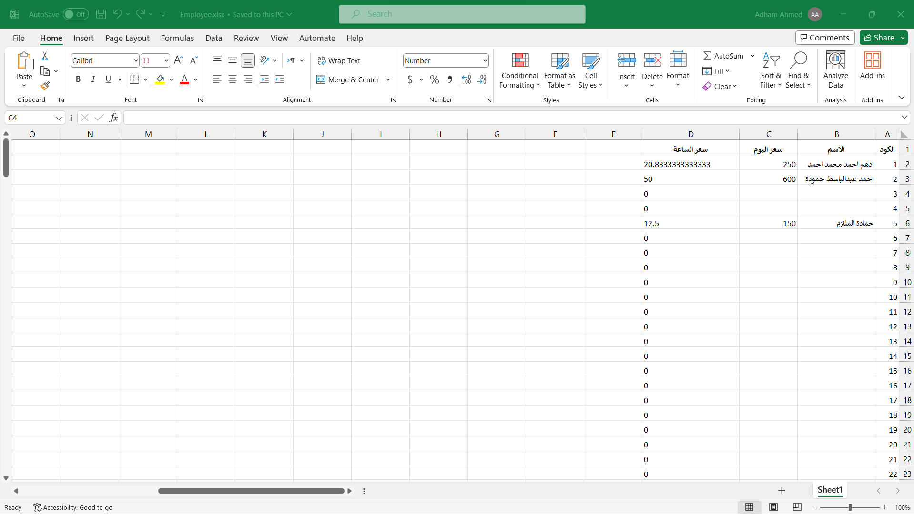

# Employee Attendance Report Generator

This Python script is designed to generate attendance and payroll reports for employees in a company using a ZK attendance machine. It utilizes the tkinter library for the user interface, openpyxl for Excel file manipulation, and the tkcalendar library for date selection. The script fetches attendance data from the ZK attendance machine, matches it with employee records from an Excel file, and generates detailed reports for each employee and a summary report for all employees.

## Prerequisites
- Python 3.x
- tkinter (for the GUI)
- openpyxl (for Excel file operations)
- tkcalendar (for date selection)
- zk (for ZK attendance machine communication)

## Usage

1. **User Interface**: The script provides a simple graphical user interface (GUI) for user input. The user is required to input the IP address of the ZK attendance machine, the start date, and the end date for the report.

2. **Data Retrieval**: The script establishes a connection with the ZK attendance machine, retrieves attendance data for the specified date range, and stores it in a dictionary where the keys are user IDs, and the values are lists of attendance timestamps.

3. **Employee Data**: It reads employee data from an Excel file named "Employee.xlsx" (must be in the same directory as the script) and stores it in a dictionary. The employee data includes employee ID, name, salary, and salary per hour.

4. **Report Generation**: The script generates two Excel files. The first file contains a summary report with the following columns:
   - Employee ID
   - Employee Name
   - Total Work Hours
   - Hourly Rate
   - Total Salary

   The second file contains detailed reports for each employee, including their ID, name, attendance, departure times, work duration, hourly rate, total earnings, and any additional notes.

5. **File Naming**: The generated Excel files are saved in a "Data" subdirectory with filenames that include the start and end dates specified in the GUI.

6. **GUI Feedback**: Upon successful report generation, a message box is displayed, confirming the completion of the report generation and displaying the chosen date range.

7. **Error Handling**: The script provides basic error handling and displays an error message if the user fails to specify a date range.

## How to Run

1. Ensure you have all the required dependencies installed.

2. Run the script in a Python environment.

3. Enter the IP address of the ZK attendance machine, select the start and end dates, and click the "Generate Report" button.

4. The reports will be generated and saved in the "Data" directory.

## Note

- This script is designed for a specific use case with ZK attendance machines and a particular Excel file format. You may need to adapt it to your specific requirements or Excel file structure.

- Make sure that the "Employee.xlsx" file with employee data is present in the same directory as the script.

- The script generates two Excel files: one for the summary report and another for individual employee reports.

- The generated files are saved in a "Data" directory with filenames that include the selected date range.

- Ensure that you have the required libraries and dependencies installed. You can install them using pip if they are not already installed.

- This script is set to generate right-to-left (RTL) Excel sheets to support Arabic text direction.

- The script includes basic error handling and user feedback.

## License

This script is provided under an open-source license. You are free to modify and use it according to your requirements.

